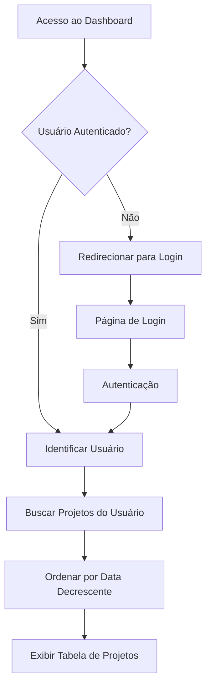

# Dashboard - Minhas Solicitações de Projeto

## 1. Product Overview
Sistema de dashboard personalizado para visualização de solicitações de projeto por usuário autenticado. Cada usuário visualiza exclusivamente seus próprios projetos em formato de tabela ordenada cronologicamente.

## 2. Core Features

### 2.1 User Roles
| Role | Registration Method | Core Permissions |
|------|---------------------|------------------|
| Usuário Autenticado | Login via Supabase Auth | Visualizar apenas projetos próprios, filtrar e ordenar dados |

### 2.2 Feature Module
Nosso dashboard consiste nas seguintes páginas principais:
1. **Dashboard**: listagem de projetos, filtros por usuário, ordenação cronológica.

### 2.3 Page Details
| Page Name | Module Name | Feature description |
|-----------|-------------|---------------------|
| Dashboard | Header | Exibir título "Minhas Solicitações de Projeto" e informações do usuário logado |
| Dashboard | Tabela de Projetos | Listar projetos do usuário com colunas: Nome da Empresa, Nome do Projeto, Responsável pelo Projeto, Área/Departamento, Prazo de Solicitação, Prazo de Entrega, Status |
| Dashboard | Sistema de Filtros | Filtrar automaticamente projetos por usuário logado (email/ID) |
| Dashboard | Ordenação | Ordenar projetos por Data da Solicitação em ordem decrescente (mais recente primeiro) |
| Dashboard | Status Visual | Exibir status com cores: "Em Andamento" (roxo #5f4a8c), "Concluído" (azul) |
| Dashboard | Autenticação | Verificar usuário logado e redirecionar para login se necessário |

## 3. Core Process
**Fluxo do Usuário:**
1. Usuário acessa a página de Dashboard
2. Sistema verifica autenticação do usuário
3. Se não autenticado, redireciona para página de login
4. Se autenticado, sistema identifica o usuário (email/ID)
5. Sistema busca no banco apenas projetos onde solicitante = usuário logado
6. Sistema ordena resultados por data de solicitação (decrescente)
7. Sistema exibe tabela com projetos filtrados
8. Usuário visualiza apenas seus projetos com status coloridos

## 4. User Interface Design
### 4.1 Design Style
- **Cores primárias**: Roxo (#5f4a8c) para "Em Andamento", Azul para "Concluído"
- **Estilo de botões**: Limpos e arredondados
- **Fonte**: Sistema padrão, tamanhos 16px (corpo), 24px (título)
- **Layout**: Tabela responsiva com cabeçalhos fixos
- **Ícones**: Minimalistas para status e ações

### 4.2 Page Design Overview
| Page Name | Module Name | UI Elements |
|-----------|-------------|-------------|
| Dashboard | Header | Título centralizado "Minhas Solicitações de Projeto", fundo branco, texto escuro |
| Dashboard | Tabela | Cabeçalhos em cinza claro, linhas alternadas, bordas sutis, status com badges coloridos |
| Dashboard | Status Badges | "Em Andamento" com fundo roxo (#5f4a8c), "Concluído" com fundo azul, texto branco, bordas arredondadas |

### 4.3 Responsiveness
Design responsivo mobile-first com breakpoints para tablet e desktop. Tabela com scroll horizontal em dispositivos menores.