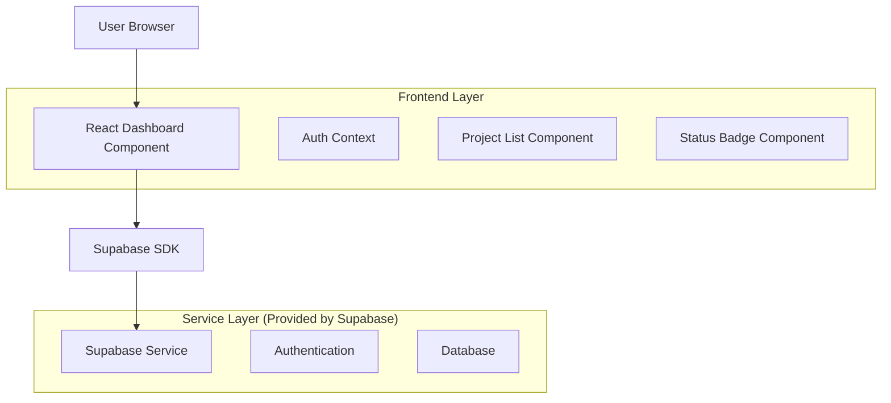
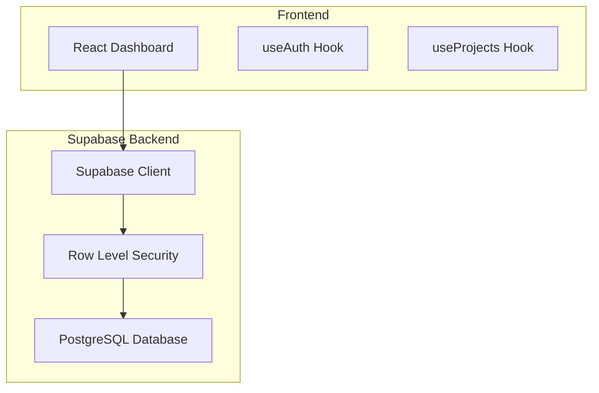
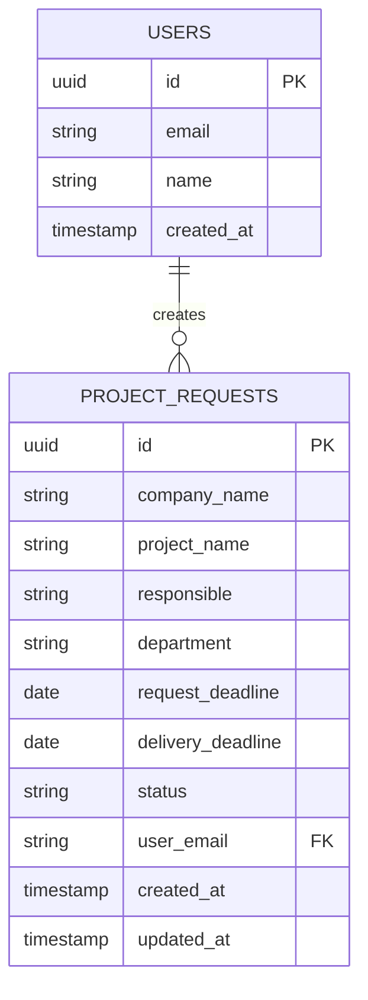

# Dashboard - Arquitetura Técnica

## 1. Architecture design



## 2. Technology Description
- Frontend: React@18 + TypeScript + tailwindcss@3 + vite
- Backend: Supabase (Authentication + Database)
- Database: Supabase (PostgreSQL)

## 3. Route definitions
| Route | Purpose |
|-------|---------|
| /dashboard | Dashboard principal, exibe projetos do usuário autenticado |
| /login | Página de login, redirecionamento quando não autenticado |

## 4. API definitions
### 4.1 Core API

Buscar projetos do usuário
```
GET /rest/v1/project_requests?select=*&user_email=eq.{email}&order=created_at.desc
```

Request:
| Param Name | Param Type | isRequired | Description |
|------------|------------|------------|--------------|
| user_email | string | true | Email do usuário autenticado |

Response:
| Param Name | Param Type | Description |
|------------|------------|-------------|
| id | uuid | ID único do projeto |
| company_name | string | Nome da empresa |
| project_name | string | Nome do projeto |
| responsible | string | Responsável pelo projeto |
| department | string | Área/Departamento |
| request_deadline | date | Prazo de solicitação |
| delivery_deadline | date | Prazo de entrega |
| status | string | Status: 'em_andamento' ou 'concluido' |
| user_email | string | Email do solicitante |
| created_at | timestamp | Data de criação |

## 5. Server architecture diagram


## 6. Data model

### 6.1 Data model definition


### 6.2 Data Definition Language

Tabela de Solicitações de Projeto (project_requests)
```sql
-- Criar tabela
CREATE TABLE project_requests (
    id UUID PRIMARY KEY DEFAULT gen_random_uuid(),
    company_name VARCHAR(255) NOT NULL,
    project_name VARCHAR(255) NOT NULL,
    responsible VARCHAR(255) NOT NULL,
    department VARCHAR(255) NOT NULL,
    request_deadline DATE NOT NULL,
    delivery_deadline DATE NOT NULL,
    status VARCHAR(20) DEFAULT 'em_andamento' CHECK (status IN ('em_andamento', 'concluido')),
    user_email VARCHAR(255) NOT NULL,
    created_at TIMESTAMP WITH TIME ZONE DEFAULT NOW(),
    updated_at TIMESTAMP WITH TIME ZONE DEFAULT NOW()
);

-- Criar índices
CREATE INDEX idx_project_requests_user_email ON project_requests(user_email);
CREATE INDEX idx_project_requests_created_at ON project_requests(created_at DESC);
CREATE INDEX idx_project_requests_status ON project_requests(status);

-- Row Level Security (RLS)
ALTER TABLE project_requests ENABLE ROW LEVEL SECURITY;

-- Política: usuários só veem seus próprios projetos
CREATE POLICY "Users can view own projects" ON project_requests
    FOR SELECT USING (auth.jwt() ->> 'email' = user_email);

-- Política: usuários só podem inserir projetos para si mesmos
CREATE POLICY "Users can insert own projects" ON project_requests
    FOR INSERT WITH CHECK (auth.jwt() ->> 'email' = user_email);

-- Política: usuários só podem atualizar seus próprios projetos
CREATE POLICY "Users can update own projects" ON project_requests
    FOR UPDATE USING (auth.jwt() ->> 'email' = user_email);

-- Permissões
GRANT SELECT ON project_requests TO anon;
GRANT ALL PRIVILEGES ON project_requests TO authenticated;

-- Dados iniciais de exemplo
INSERT INTO project_requests (
    company_name, project_name, responsible, department, 
    request_deadline, delivery_deadline, status, user_email
) VALUES 
('Empresa ABC', 'Website Institucional', 'João Silva', 'Marketing', 
 '2024-02-15', '2024-03-15', 'em_andamento', 'danilo.alves@email.com'),
('Empresa XYZ', 'Sistema de Vendas', 'Maria Santos', 'TI', 
 '2024-01-20', '2024-04-20', 'concluido', 'danilo.alves@email.com'),
('Startup Tech', 'App Mobile', 'Pedro Costa', 'Produto', 
 '2024-03-01', '2024-06-01', 'em_andamento', 'danilo.alves@email.com');
```