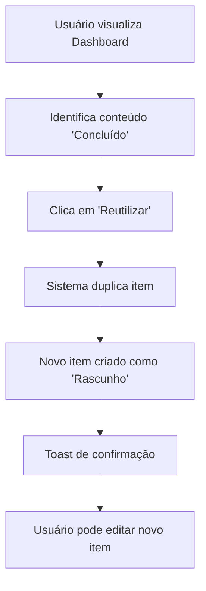
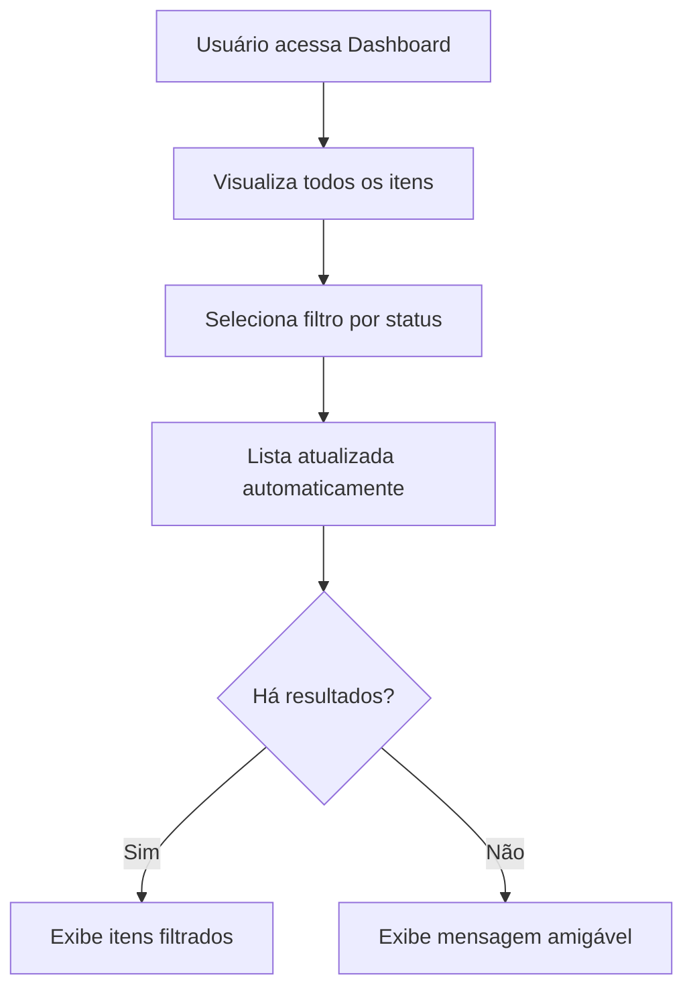

# Melhorias de UI/UX - Tela de Dashboard

## 1. Visão Geral do Projeto

Este documento especifica as melhorias de UI/UX para a Tela de Dashboard, focando em aprimorar a experiência do usuário mantendo consistência visual com as demais telas (Briefing, Guia, Manual) e introduzindo funcionalidades de reaproveitamento de conteúdo.

**Objetivo Principal:** Simplificar o layout, melhorar a usabilidade e adicionar funcionalidades que aumentem a produtividade do usuário.

**Escopo:** Melhorias exclusivamente de interface e experiência do usuário, sem alterações na lógica de dados existente.

## 2. Funcionalidades Principais

### 2.1 Função de Reaproveitamento de Conteúdo

**Descrição:** Permitir que usuários reutilizem conteúdos já concluídos como base para novos projetos.

**Comportamento:**
- Botão "Reutilizar" disponível apenas para itens com status "Concluído"
- Duplica o item mantendo todas as seleções das telas Briefing, Guia e Manual
- Novo item recebe um ID único e campo `origin_id` com referência ao item original
- Novo item criado com status "Rascunho" e totalmente editável
- Permite rastreabilidade de quais conteúdos foram derivados de outros
- Toast de confirmação: "Conteúdo reaproveitado com sucesso. Você pode editá-lo antes de publicar."

### 2.2 Otimização da Tabela

**Remoção de Colunas:**
- Excluir coluna "Prazo de Entrega"
- Excluir coluna "Responsável"
- Redistribuir espaço das colunas restantes para melhor equilíbrio visual

### 2.3 Sistema de Filtros e Ordenação

**Filtros por Status:**
- Rascunho
- Em progresso  
- Concluído
- Opção "Todos" (padrão)

**Ordenação:**
- Por data de criação (mais recente primeiro - padrão)
- Por título (A-Z)
- Indicador visual da ordenação ativa

**Estado Vazio:**
- Mensagem amigável: "Nenhum conteúdo encontrado com este filtro."
- Sugestão de ação quando aplicável

## 3. Melhorias Visuais

### 3.1 Hierarquia e Tipografia

**Títulos e Cabeçalhos:**
- Aplicar mesma tipografia das telas Guia e Manual
- Melhorar contraste e alinhamento
- Hierarquia visual clara entre título principal e subtítulos

**Consistência Visual:**
- Usar componentes visuais padronizados das outras telas
- Manter cores, margens e espaçamentos do design system existente
- Evitar introdução de novos padrões visuais

### 3.2 Elementos Interativos

**Botões e Ações:**
- Substituir botões genéricos por ícones com tooltips descritivos
- Estados visuais: hover, active, disabled
- Loading states para ações assíncronas

**Feedback Visual:**
- Tooltips informativos em todos os elementos interativos
- Estados de loading durante operações
- Confirmações visuais para ações importantes

## 4. Responsividade

### 4.1 Adaptação para Dispositivos Móveis

**Layout da Tabela:**
- Conversão para cards em telas menores (< 768px)
- Manter todas as funcionalidades acessíveis
- Navegação otimizada para touch

**Filtros e Controles:**
- Dropdown compacto para filtros em mobile
- Botões de ação adequados para touch (min 44px)
- Espaçamento adequado entre elementos interativos

### 4.2 Breakpoints

- **Desktop:** ≥ 1024px - Layout completo da tabela
- **Tablet:** 768px - 1023px - Tabela compacta
- **Mobile:** < 768px - Layout em cards

## 5. Especificações Técnicas

### 5.1 Estrutura de Componentes

```typescript
// Estrutura sugerida dos componentes
interface DashboardFilters {
  status: 'rascunho' | 'em_progresso' | 'concluido' | 'todos';
  sortBy: 'created_at' | 'title';
  sortOrder: 'asc' | 'desc';
}

interface ContentItem {
  id: string;
  title: string;
  status: string;
  created_at: string;
  origin_id?: string; // ID do conteúdo original, se for uma duplicação
  // Dados das telas Briefing, Guia, Manual para reaproveitamento
  briefing_data?: object;
  guia_data?: object;
  manual_data?: object;
}
```

### 5.2 Hooks e Estado

**Estado Local:**
- Filtros ativos
- Ordenação atual
- Loading states
- Mensagens de feedback

**Funções Principais:**
- `handleReuseContent(item: ContentItem)` - Reaproveitamento
- `handleFilterChange(filters: DashboardFilters)` - Filtros
- `handleSort(field: string)` - Ordenação

### 5.3 Integração com Backend

**Endpoints Necessários:**
- `POST /api/content/duplicate` - Duplicar conteúdo (gera novo ID e define origin_id)
- `GET /api/content?status=&sort=` - Listar com filtros
- Manter endpoints existentes inalterados

**Payload de Duplicação:**
```typescript
// Request
{
  originalId: string; // ID do item a ser duplicado
}

// Response
{
  id: string; // Novo ID único gerado
  origin_id: string; // ID do item original
  status: 'rascunho';
  // ... demais campos copiados
}
```

## 6. Fluxo de Usuário

### 6.1 Reaproveitamento de Conteúdo



### 6.2 Filtros e Busca



## 7. Critérios de Validação

### 7.1 Funcionalidade

- [ ] Função "Reutilizar" funciona corretamente para itens concluídos
- [ ] Filtros por status funcionam adequadamente
- [ ] Ordenação por data e título funciona
- [ ] Toast de confirmação aparece após reaproveitamento
- [ ] Novo item é criado como "Rascunho" e é editável

### 7.2 Interface

- [ ] Layout consistente com telas Guia e Manual
- [ ] Colunas "Prazo de Entrega" e "Responsável" removidas
- [ ] Tipografia e hierarquia visual melhoradas
- [ ] Ícones com tooltips implementados
- [ ] Estados de loading e hover funcionais

### 7.3 Responsividade

- [ ] Layout adapta corretamente em mobile (cards)
- [ ] Filtros acessíveis em todas as telas
- [ ] Botões têm tamanho adequado para touch
- [ ] Não há quebras de layout em diferentes resoluções

### 7.4 Performance

- [ ] Filtros não causam recarregamento desnecessário
- [ ] Loading states adequados durante operações
- [ ] Sem regressões na performance existente

## 8. Implementação

### 8.1 Fases de Desenvolvimento

**Fase 1: Estrutura e Filtros**
- Implementar sistema de filtros
- Adicionar ordenação
- Remover colunas obsoletas

**Fase 2: Reaproveitamento**
- Implementar função de duplicação
- Adicionar botão "Reutilizar"
- Implementar toast de confirmação

**Fase 3: Melhorias Visuais**
- Aplicar nova tipografia
- Adicionar ícones e tooltips
- Implementar estados visuais

**Fase 4: Responsividade**
- Adaptar layout para mobile
- Testar em diferentes dispositivos
- Ajustes finais de UX

### 8.2 Padrões de Commit

```
feat(ui/dashboard): adicionar função de reaproveitamento de conteúdo
feat(ui/dashboard): implementar filtros por status e ordenação
chore(ui/dashboard): remover colunas obsoletas da tabela
style(ui/dashboard): melhorar hierarquia visual e tipografia
feat(ui/dashboard): adicionar responsividade para mobile
```

### 8.3 Deploy e Validação

- **Branch:** `ajustes/seguro-rollback`
- **Deploy Preview:** Automático via Netlify
- **Backup:** Tag `backup-pre-ajustes-2025-10-27`
- **Validação:** Preview antes do merge para `main`

## 9. Considerações de Acessibilidade

### 9.1 Navegação por Teclado

- Todos os elementos interativos acessíveis via Tab
- Ordem lógica de navegação
- Indicadores visuais de foco

### 9.2 Leitores de Tela

- Labels descritivos em todos os controles
- Aria-labels para ícones
- Anúncios de mudanças de estado

### 9.3 Contraste e Legibilidade

- Contraste mínimo WCAG AA (4.5:1)
- Texto legível em todos os tamanhos
- Ícones com significado claro

## 10. Manutenção e Evolução

### 10.1 Monitoramento

- Acompanhar uso da função de reaproveitamento
- Monitorar performance dos filtros
- Feedback dos usuários sobre melhorias

### 10.2 Futuras Melhorias

- Busca textual por título/conteúdo
- Filtros avançados (data, tipo de conteúdo)
- Ações em lote (excluir múltiplos itens)
- Exportação de dados

---

**Documento criado em:** 27/10/2025  
**Versão:** 1.0  
**Status:** Em desenvolvimento  
**Branch:** ajustes/seguro-rollback