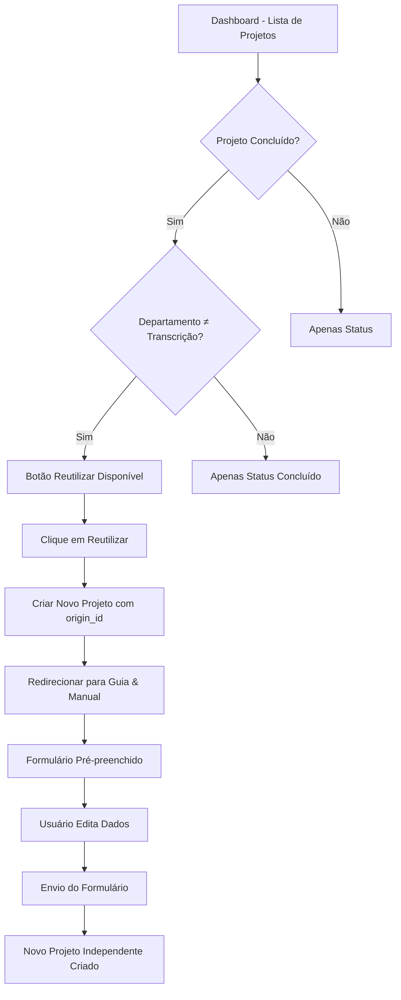

# Requisitos para Funcionalidade de Reutilização de Projetos

## 1. Visão Geral do Produto

Sistema de reutilização de projetos que permite aos usuários criar novos projetos baseados em projetos concluídos anteriormente, mantendo os dados originais como ponto de partida para edição e personalização.

O sistema visa aumentar a eficiência na criação de projetos similares, permitindo que usuários aproveitem configurações e dados de projetos bem-sucedidos como base para novos desenvolvimentos.

## 2. Funcionalidades Principais

### 2.1 Papéis de Usuário

| Papel | Método de Registro | Permissões Principais |
|-------|-------------------|----------------------|
| Usuário Autenticado | Login via Supabase Auth | Pode visualizar, criar e reutilizar seus próprios projetos |

### 2.2 Módulos de Funcionalidade

O sistema de reutilização de projetos consiste nas seguintes páginas principais:

1. **Dashboard**: Listagem de projetos com opção de reutilização
2. **Guia & Manual**: Formulário pré-preenchido para edição de projeto reutilizado

### 2.3 Detalhes das Páginas

| Nome da Página | Nome do Módulo | Descrição da Funcionalidade |
|----------------|----------------|----------------------------|
| Dashboard | Listagem de Projetos | Exibir projetos do usuário com status e ações disponíveis |
| Dashboard | Botão Reutilizar | Aparecer apenas para projetos concluídos (exceto departamento "Transcrição") |
| Dashboard | Criação de Projeto Reutilizado | Criar novo registro na tabela project_requests com origin_id |
| Guia & Manual | Carregamento de Dados | Detectar parâmetro de reutilização e carregar dados do projeto original |
| Guia & Manual | Formulário Pré-preenchido | Exibir todos os campos preenchidos com dados do projeto original |
| Guia & Manual | Edição Livre | Permitir modificação de todos os campos antes do envio |
| Guia & Manual | Envio Independente | Criar novo projeto independente mantendo apenas vinculação por origin_id |

## 3. Fluxo Principal

### Fluxo de Reutilização de Projeto

1. **Usuário acessa Dashboard** → Visualiza lista de projetos
2. **Usuário identifica projeto concluído** → Verifica se botão "Reutilizar" está disponível
3. **Usuário clica em "Reutilizar"** → Sistema cria novo projeto com origin_id
4. **Sistema redireciona para Guia & Manual** → Formulário carregado com dados originais
5. **Usuário edita dados conforme necessário** → Modifica campos e anexa novos arquivos
6. **Usuário envia formulário** → Novo projeto independente é criado

## 4. Design da Interface

### 4.1 Estilo de Design

- **Cores Primárias**: Azul (#3B82F6) para ações principais, Verde (#10B981) para status concluído
- **Cores Secundárias**: Cinza (#6B7280) para textos secundários, Roxo (#8B5CF6) para elementos de destaque
- **Estilo de Botões**: Arredondados com hover effects e estados de loading
- **Fontes**: Sistema padrão com tamanhos hierárquicos (text-sm, text-base, text-lg)
- **Layout**: Card-based com sombras suaves e transições smooth
- **Ícones**: Lucide React com estilo outline, tamanho 16px para botões

### 4.2 Visão Geral do Design das Páginas

| Nome da Página | Nome do Módulo | Elementos da UI |
|----------------|----------------|-----------------|
| Dashboard | Botão Reutilizar | Botão azul com ícone Copy, texto "Reutilizar", hover effect, estado disabled durante loading |
| Dashboard | Indicador de Projeto Reutilizado | Badge pequeno azul com ícone Copy e texto "Reutilizado" para projetos que foram criados por reutilização |
| Guia & Manual | Indicador de Modo Reutilização | Banner informativo no topo indicando que o formulário foi pré-preenchido com dados de projeto anterior |
| Guia & Manual | Campos Pré-preenchidos | Todos os campos do formulário preenchidos com dados originais, com destaque visual sutil |

### 4.3 Responsividade

O sistema é mobile-first com adaptação para desktop. A funcionalidade de reutilização mantém a mesma experiência em ambas as plataformas, com botões e indicadores adequadamente dimensionados para touch interaction em dispositivos móveis.