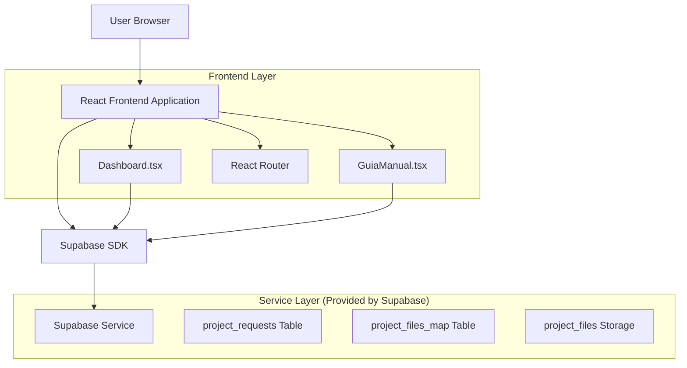
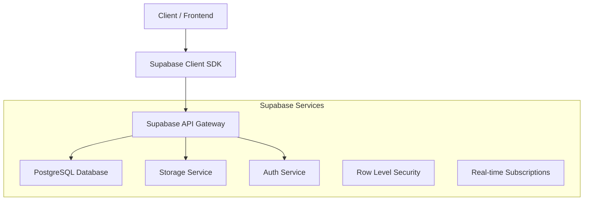
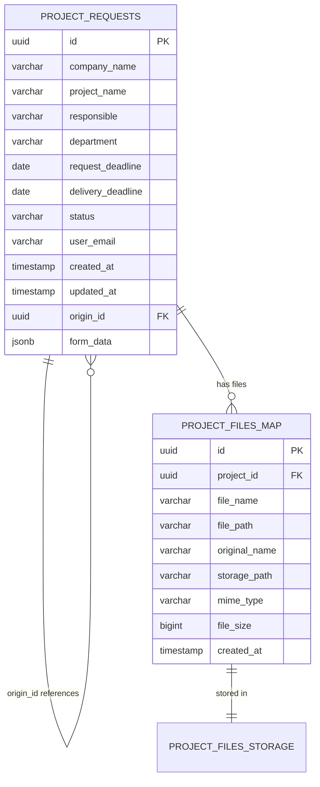

# Arquitetura Técnica - Funcionalidade de Reutilização de Projetos

## 1. Design da Arquitetura



## 2. Descrição das Tecnologias

- Frontend: React@18 + TypeScript + Tailwind CSS + Vite
- Backend: Supabase (PostgreSQL + Storage + Auth)
- Roteamento: React Router DOM
- Estado: React useState/useEffect
- UI: Lucide React Icons

## 3. Definições de Rotas

| Rota | Propósito |
|------|-----------|
| /dashboard | Dashboard principal com listagem de projetos e funcionalidade de reutilização |
| /guia-manual | Formulário de criação/edição de projetos, com suporte a pré-preenchimento |
| /guia-manual?reuse=:projectId | Formulário pré-preenchido com dados do projeto especificado |

## 4. Definições de API

### 4.1 APIs Principais do Supabase

**Buscar projeto para reutilização**
```typescript
// GET project data for reuse
const { data, error } = await supabase
  .from('project_requests')
  .select('*')
  .eq('id', projectId)
  .single()
```

**Criar projeto reutilizado**
```typescript
// POST new project with origin_id
const { data, error } = await supabase
  .from('project_requests')
  .insert({
    ...originalProjectData,
    id: undefined, // Remove original ID
    origin_id: originalProjectId,
    status: 'em_andamento',
    created_at: undefined,
    updated_at: undefined
  })
```

### 4.2 Estrutura de Dados

**ProjectRequest Interface**
```typescript
interface ProjectRequest {
  id: string
  company_name: string
  project_name: string
  responsible: string
  department: string
  request_deadline: string
  delivery_deadline: string
  status: 'aguardando_ingestao' | 'em_andamento' | 'concluido'
  user_email: string
  created_at: string
  updated_at: string
  origin_id?: string
  form_data?: FormData
}

interface FormData {
  nomeEmpresa: string
  nomeProjeto: string
  responsavelNome: string
  responsavelEmail: string
  areaDepartamento: string
  prazoEntrega: string
  objetivo: string
  tomVoz: string
  cargo: string
  escolaridade: string
  dominioTecnico: string
  quantidadeSecoes: string
  pontosCriticos: string
  estiloVisual: string[]
  anexos: File[]
}
```

## 5. Arquitetura do Servidor



## 6. Modelo de Dados

### 6.1 Definição do Modelo de Dados



### 6.2 Linguagem de Definição de Dados

**Verificar e adicionar campo form_data (se necessário)**
```sql
-- Verificar se o campo form_data existe
DO $$
BEGIN
  IF NOT EXISTS (
    SELECT 1 FROM information_schema.columns 
    WHERE table_name = 'project_requests' 
    AND column_name = 'form_data'
  ) THEN
    -- Adicionar campo form_data como JSONB
    ALTER TABLE project_requests 
    ADD COLUMN form_data JSONB;
    
    -- Criar índice para consultas no form_data
    CREATE INDEX idx_project_requests_form_data 
    ON project_requests USING GIN (form_data);
    
    -- Comentário para documentar o campo
    COMMENT ON COLUMN project_requests.form_data 
    IS 'Dados completos do formulário em formato JSON para reutilização';
  END IF;
END $$;
```

**Políticas de Segurança (RLS)**
```sql
-- Política para reutilização: usuários podem ler projetos próprios para reutilizar
CREATE POLICY "Users can read own projects for reuse" ON project_requests
  FOR SELECT USING (
    auth.jwt() ->> 'email' = user_email
  );

-- Política para criação de projetos reutilizados
CREATE POLICY "Users can create reused projects" ON project_requests
  FOR INSERT WITH CHECK (
    auth.jwt() ->> 'email' = user_email AND
    (origin_id IS NULL OR 
     origin_id IN (
       SELECT id FROM project_requests 
       WHERE user_email = auth.jwt() ->> 'email'
     ))
  );
```

**Dados de Exemplo**
```sql
-- Exemplo de projeto com form_data para teste
INSERT INTO project_requests (
  company_name, project_name, responsible, department,
  request_deadline, delivery_deadline, status, user_email,
  form_data
) VALUES (
  'Empresa Teste', 'Manual de Procedimentos', 'João Silva', 'Recursos Humanos',
  '2024-03-15', '2024-04-15', 'concluido', 'usuario@teste.com',
  '{
    "nomeEmpresa": "Empresa Teste",
    "nomeProjeto": "Manual de Procedimentos",
    "responsavelNome": "João Silva",
    "responsavelEmail": "joao@empresa.com",
    "areaDepartamento": "Recursos Humanos",
    "prazoEntrega": "2024-04-15",
    "objetivo": "Treinamento",
    "tomVoz": "Formal",
    "cargo": "Analista",
    "escolaridade": "Superior",
    "dominioTecnico": "Intermediário",
    "quantidadeSecoes": "5",
    "pontosCriticos": "Atenção especial aos procedimentos de segurança",
    "estiloVisual": ["Diagramas", "Listas"],
    "anexos": []
  }'::jsonb
);
```