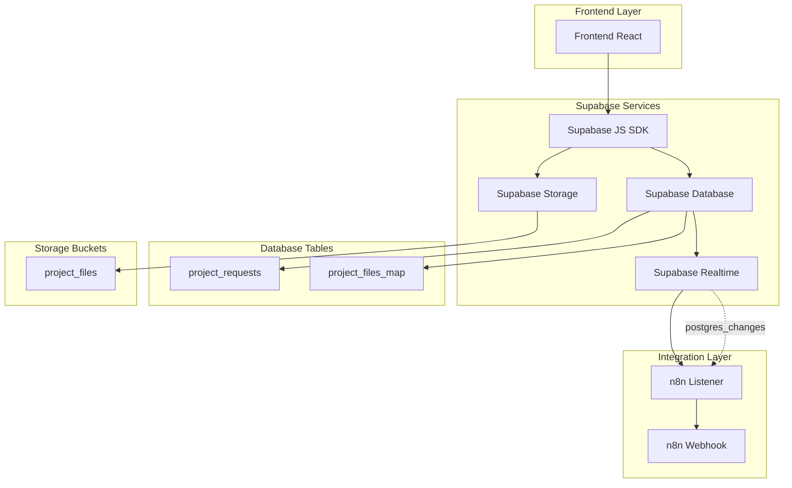
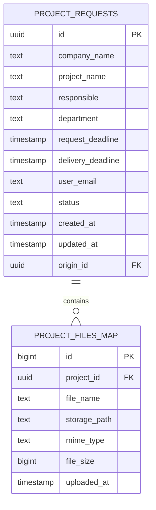
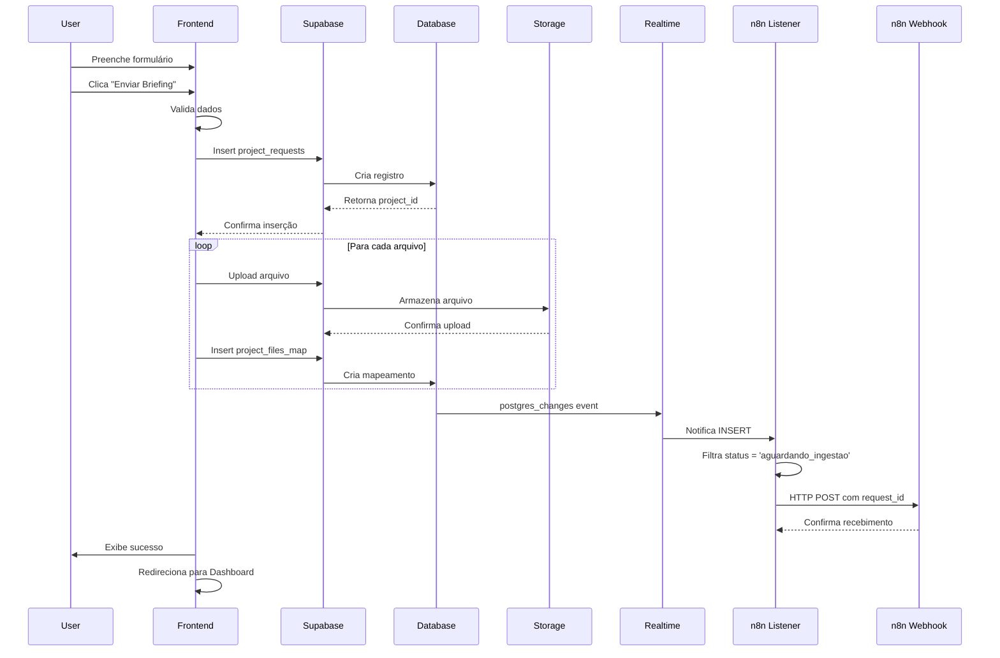
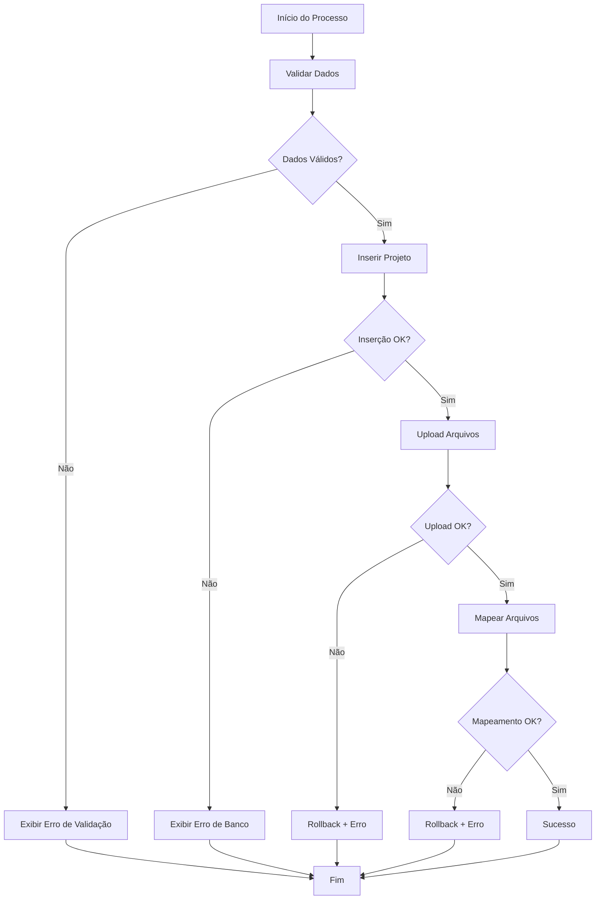
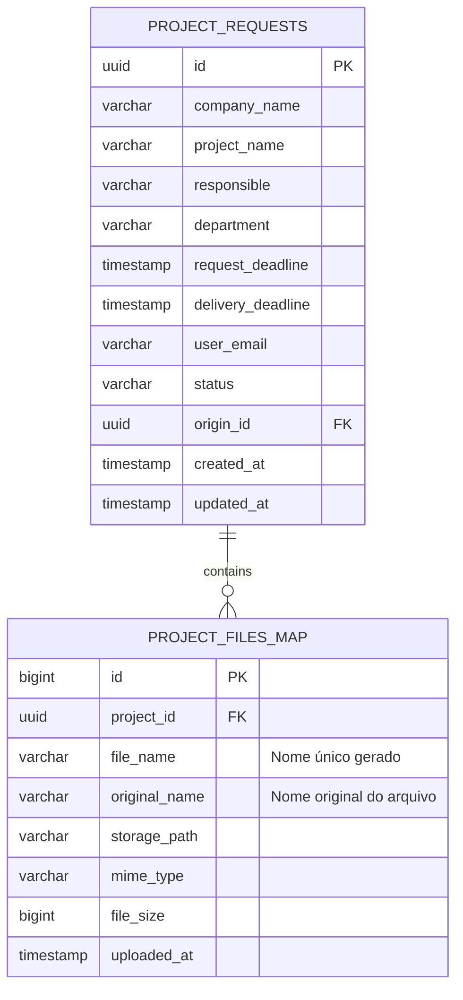

# Arquitetura Técnica - Submissão Direta ao Supabase

## 1. Arquitetura do Sistema



## 2. Tecnologias Utilizadas

- **Frontend:** React@18 + TypeScript + Vite
- **Backend:** Supabase (PostgreSQL + Storage + Triggers)
- **SDK:** @supabase/supabase-js
- **Styling:** TailwindCSS
- **External Integration:** n8n via HTTP triggers

## 3. Estrutura de Rotas

| Rota | Componente | Funcionalidade |
|------|------------|----------------|
| `/guia-manual` | GuiaManual.tsx | Formulário de submissão com integração Supabase |
| `/dashboard` | Dashboard.tsx | Visualização de projetos submetidos |

## 4. APIs e Integrações

### 4.1 Supabase Database Operations

**Inserção de Projeto:**
```typescript
interface ProjectRequest {
  company_name: string;
  project_name: string;
  responsible: string;
  department: string;
  request_deadline: string;
  delivery_deadline: string;
  user_email: string;
  status: 'aguardando_ingestao' | 'em_andamento' | 'concluido';
}

// Inserir projeto
const { data, error } = await supabase
  .from('project_requests')
  .insert(projectData)
  .select('id')
  .single();
```

**Mapeamento de Arquivos:**
```typescript
interface ProjectFileMap {
  project_id: string;
  file_name: string;
  storage_path: string;
  mime_type: string;
  file_size: number;
}

// Inserir metadados do arquivo
const { error } = await supabase
  .from('project_files_map')
  .insert(fileMetadata);
```

### 4.2 Supabase Storage Operations

**Upload de Arquivo:**
```typescript
// Upload para bucket privado
const { data, error } = await supabase.storage
  .from('project_files')
  .upload(`projects/${projectId}/${fileName}`, file);
```

**Estrutura de Pastas:**
```
project_files/
├── projects/
│   ├── {project_id_1}/
│   │   ├── documento1.pdf
│   │   ├── imagem1.jpg
│   │   └── planilha1.xlsx
│   ├── {project_id_2}/
│   │   ├── arquivo1.docx
│   │   └── arquivo2.pdf
│   └── ...
```

### 4.3 Realtime Integration (Substituindo Triggers SQL)

**⚠️ Importante:** A função `http_post` não é nativa do Supabase e pode causar falhas silenciosas. Utilizamos o modelo Realtime + listener que é nativo e mais robusto.

**Listener no n8n ou Microserviço de Integração:**
```javascript
// Configuração do listener Realtime
const supabase = createClient(SUPABASE_URL, SUPABASE_ANON_KEY);

// Listener para novos projetos
supabase
  .channel('new_projects')
  .on(
    'postgres_changes',
    { 
      event: 'INSERT', 
      schema: 'public', 
      table: 'project_requests' 
    },
    async (payload) => {
      // Filtrar apenas projetos aguardando ingestão
      if (payload.new.status === 'aguardando_ingestao') {
        try {
          // Notificar n8n via webhook
          await fetch('https://n8n.suaurl.com/webhook/ingest', {
            method: 'POST',
            headers: { 
              'Content-Type': 'application/json',
              'Authorization': 'Bearer YOUR_N8N_TOKEN' // Opcional
            },
            body: JSON.stringify({
              request_id: payload.new.id,
              status: payload.new.status,
              created_at: payload.new.created_at,
              project_name: payload.new.project_name,
              company_name: payload.new.company_name
            })
          });
          
          console.log(`✅ Projeto ${payload.new.id} enviado para n8n`);
        } catch (error) {
          console.error('❌ Erro ao notificar n8n:', error);
          // Implementar retry logic ou dead letter queue
        }
      }
    }
  )
  .subscribe();
```

**Vantagens do Modelo Realtime:**
- ✅ **Nativo do Supabase:** Sem dependência de extensões
- ✅ **Compatibilidade Total:** Funciona em Supabase Cloud
- ✅ **Sem Falhas Silenciosas:** Erros são capturados e tratados
- ✅ **Facilmente Escalável:** Múltiplos listeners podem ser configurados
- ✅ **Tempo Real:** Notificação instantânea
- ✅ **Flexível:** Permite filtros e transformações complexas

## 5. Modelo de Dados

### 5.1 Diagrama ER



### 5.2 DDL (Data Definition Language)

**Atualização da Tabela `project_requests`:**
```sql
-- Atualizar constraint de status
ALTER TABLE public.project_requests 
DROP CONSTRAINT IF EXISTS project_requests_status_check;

ALTER TABLE public.project_requests 
ADD CONSTRAINT project_requests_status_check 
CHECK (status IN ('aguardando_ingestao', 'em_andamento', 'concluido'));
```

**Criação da Tabela `project_files_map`:**
```sql
CREATE TABLE IF NOT EXISTS public.project_files_map (
  id BIGSERIAL PRIMARY KEY,
  project_id UUID NOT NULL REFERENCES public.project_requests(id) ON DELETE CASCADE,
  file_name TEXT NOT NULL,
  storage_path TEXT NOT NULL UNIQUE,
  mime_type TEXT,
  file_size BIGINT,
  uploaded_at TIMESTAMP WITH TIME ZONE DEFAULT now()
);

-- Índices para performance
CREATE INDEX idx_project_files_map_project_id ON public.project_files_map(project_id);
CREATE INDEX idx_project_files_map_uploaded_at ON public.project_files_map(uploaded_at DESC);
CREATE INDEX idx_project_files_map_storage_path ON public.project_files_map(storage_path);
```

**Políticas de Segurança (RLS):**
```sql
// Habilitar RLS na tabela project_files_map
ALTER TABLE public.project_files_map ENABLE ROW LEVEL SECURITY;

// Política para usuários autenticados
CREATE POLICY "Users can view their own project files" ON public.project_files_map
  FOR SELECT USING (
    project_id IN (
      SELECT id FROM public.project_requests 
      WHERE user_email = auth.jwt() ->> 'email'
    )
  );

CREATE POLICY "Users can insert their own project files" ON public.project_files_map
  FOR INSERT WITH CHECK (
    project_id IN (
      SELECT id FROM public.project_requests 
      WHERE user_email = auth.jwt() ->> 'email'
    )
  );
```

**Configuração do Storage Bucket:**
```sql
// Criar bucket privado
INSERT INTO storage.buckets (id, name, public) 
VALUES ('project_files', 'project_files', false);

// Política de acesso para upload
CREATE POLICY "Users can upload their own project files" ON storage.objects
  FOR INSERT WITH CHECK (
    bucket_id = 'project_files' AND
    auth.role() = 'authenticated' AND
    (storage.foldername(name))[1] = 'projects'
  );

// Política de acesso para download
CREATE POLICY "Users can download their own project files" ON storage.objects
  FOR SELECT USING (
    bucket_id = 'project_files' AND
    auth.role() = 'authenticated'
  );
```

## 6. Fluxo de Dados Detalhado

### 6.1 Sequência de Operações



### 6.2 Tratamento de Erros



## 7. Configuração de Ambiente

### 7.1 Variáveis de Ambiente

```env
# Supabase Configuration
VITE_SUPABASE_URL=https://your-project.supabase.co
VITE_SUPABASE_ANON_KEY=your-anon-key

# n8n Integration (para triggers)
N8N_WEBHOOK_URL=https://n8n.suaurl.com/webhook/ingest
```

### 7.2 Configuração do Supabase Client

```typescript
// lib/supabaseClient.ts
import { createClient } from '@supabase/supabase-js';

const supabaseUrl = import.meta.env.VITE_SUPABASE_URL;
const supabaseAnonKey = import.meta.env.VITE_SUPABASE_ANON_KEY;

export const supabase = createClient(supabaseUrl, supabaseAnonKey);
```

## 8. Monitoramento e Performance

### 8.1 Métricas de Sistema

- **Database Performance:**
  - Tempo de resposta de queries
  - Número de conexões ativas
  - Uso de índices

- **Storage Performance:**
  - Tempo de upload por arquivo
  - Taxa de sucesso de uploads
  - Uso de bandwidth

- **Trigger Performance:**
  - Tempo de execução de triggers
  - Taxa de sucesso de notificações para n8n
  - Latência de integração

### 8.2 Logs e Debugging

```typescript
// Exemplo de logging estruturado
const logOperation = (operation: string, data: any, success: boolean) => {
  console.log({
    timestamp: new Date().toISOString(),
    operation,
    data,
    success,
    user: user?.email
  });
};
```

## 9. Segurança e Compliance

### 9.1 Controle de Acesso

- **Autenticação:** Supabase Auth (JWT)
- **Autorização:** Row Level Security (RLS)
- **Storage:** Políticas baseadas em usuário autenticado
- **API:** Rate limiting via Supabase

### 9.2 Validação de Dados

```typescript
// Validação de tipos de arquivo
const allowedMimeTypes = [
  'application/pdf',
  'image/jpeg',
  'image/png',
  'application/vnd.openxmlformats-officedocument.wordprocessingml.document',
  'application/vnd.openxmlformats-officedocument.spreadsheetml.sheet'
];

// Validação de tamanho (max 10MB)
const maxFileSize = 10 * 1024 * 1024;
```

## 10. Deploy e Manutenção

### 10.1 Pipeline de Deploy

1. **Desenvolvimento:** Testes locais com Supabase local
2. **Staging:** Deploy para ambiente de teste
3. **Produção:** Deploy via Netlify com variáveis de ambiente

### 10.2 Backup e Recovery

- **Database:** Backup automático via Supabase
- **Storage:** Replicação automática de arquivos
- **Code:** Versionamento via Git com tags de release

---

**Versão:** 2.0.0-supabase-integration  
**Data:** 2025-01-27  
**Status:** Arquitetura Definida

## 4. API definitions

### 4.1 Upload de Arquivos com Nomenclatura Única

**Problema:** Risco de sobrescrita de arquivos com mesmo nome no bucket `project_files`.

**Solução:** Implementar padronização de nomes com timestamp para evitar colisões:

```javascript
// Gerar nome único para evitar colisões
const uniqueName = `${Date.now()}_${file.name}`;
const path = `projects/${projectId}/${uniqueName}`;

// Upload para Supabase Storage
const { error: uploadError } = await supabase.storage
  .from('project_files')
  .upload(path, file);

if (!uploadError) {
  // Inserir metadados com nome original e único
  await supabase.from('project_files_map').insert({
    project_id: projectId,
    file_name: uniqueName,           // Nome único gerado
    original_name: file.name,        // Nome original preservado
    storage_path: path,
    mime_type: file.type,
    file_size: file.size
  });
}
```

**Vantagens:**
- ✅ Evita colisões de nomes de arquivos
- ✅ Versionamento automático por timestamp
- ✅ Preserva nome original para exibição
- ✅ Rastreabilidade completa de uploads

### 6.1 Data model



### 6.2 Data Definition Language

**Tabela project_files_map (Atualizada com campo original_name):**
```sql
-- Criar tabela para mapeamento de arquivos
CREATE TABLE IF NOT EXISTS public.project_files_map (
    id BIGSERIAL PRIMARY KEY,
    project_id UUID NOT NULL REFERENCES public.project_requests(id) ON DELETE CASCADE,
    file_name TEXT NOT NULL,           -- Nome único gerado (timestamp_original)
    original_name TEXT NOT NULL,       -- Nome original do arquivo
    storage_path TEXT NOT NULL,        -- Caminho completo no storage
    mime_type TEXT,
    file_size BIGINT,
    uploaded_at TIMESTAMP WITH TIME ZONE DEFAULT now()
);

-- Índices para performance
CREATE INDEX idx_project_files_map_project_id ON public.project_files_map(project_id);
CREATE INDEX idx_project_files_map_uploaded_at ON public.project_files_map(uploaded_at DESC);

-- Políticas RLS
ALTER TABLE public.project_files_map ENABLE ROW LEVEL SECURITY;

-- Usuários autenticados podem ver apenas seus próprios arquivos
CREATE POLICY "Users can view own project files" ON public.project_files_map
    FOR SELECT USING (
        project_id IN (
            SELECT id FROM public.project_requests 
            WHERE user_email = auth.jwt() ->> 'email'
        )
    );

-- Usuários autenticados podem inserir arquivos em seus próprios projetos
CREATE POLICY "Users can insert own project files" ON public.project_files_map
    FOR INSERT WITH CHECK (
        project_id IN (
            SELECT id FROM public.project_requests 
            WHERE user_email = auth.jwt() ->> 'email'
        )
    );
```

**Estrutura do Bucket project_files:**
```
project_files/
├── projects/
│   ├── {project_id_1}/
│   │   ├── 1698765432000_documento.pdf
│   │   ├── 1698765433000_planilha.xlsx
│   │   └── 1698765434000_imagem.jpg
│   ├── {project_id_2}/
│   │   ├── 1698765435000_briefing.docx
│   │   └── 1698765436000_referencias.zip
│   └── ...
```