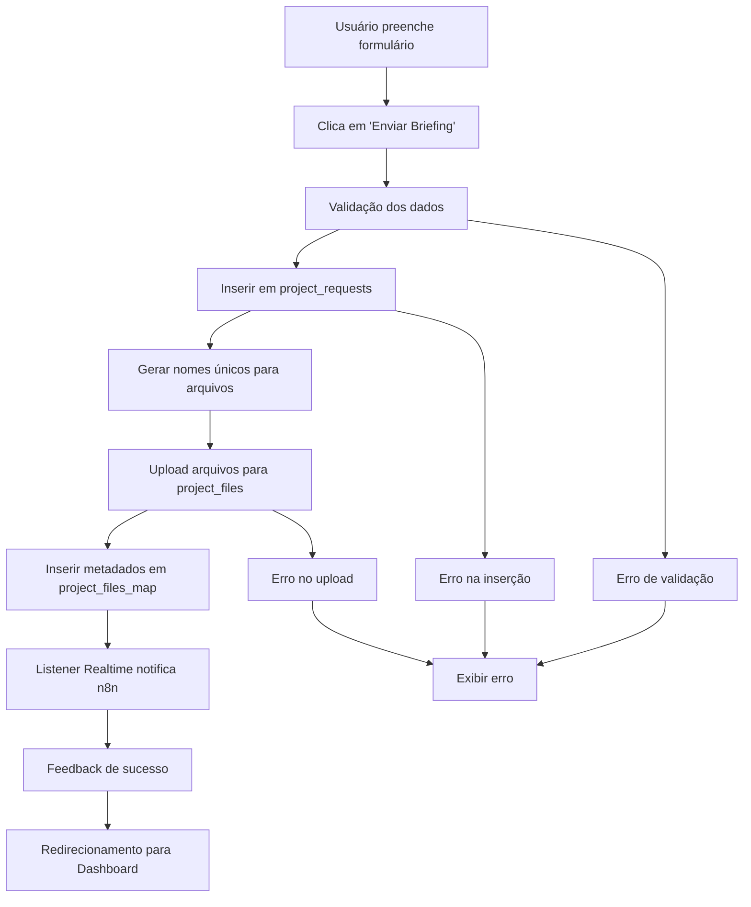

# Submissão Direta ao Supabase - Formulário Guia e Manual

## 1. Visão Geral do Projeto

**Objetivo:** Modificar o fluxo de envio do formulário "Guia e Manual" para que os dados e arquivos sejam salvos diretamente no Supabase, substituindo completamente o envio via webhook.

**Problema Atual:** O frontend envia dados do formulário e arquivos para um webhook do n8n (`https://webhook.reduct.agency/webhook/guia-manual`), criando dependência externa e falta de rastreabilidade.

**Solução Proposta:** Integração direta com Supabase para persistência de dados e arquivos, com listener Realtime para notificar o n8n automaticamente quando necessário.

## 2. Funcionalidades Principais

### 2.1 Fluxo de Submissão Atualizado

**Processo Atual (com webhook):**
1. Usuário preenche formulário "Guia e Manual"
2. Clica em "Enviar Briefing"
3. Frontend envia dados para webhook n8n
4. n8n processa dados externamente

**Novo Processo (direto no Supabase):**
1. Usuário preenche formulário "Guia e Manual"
2. Clica em "Enviar Briefing"
3. Frontend cria registro em `project_requests` com status `aguardando_ingestao`
4. Upload de arquivos para bucket `project_files`
5. Mapeamento de metadados em `project_files_map`
6. Listener Realtime notifica n8n com `request_id`
7. Feedback visual de sucesso para o usuário

### 2.2 Componentes do Sistema

| Componente | Função | Status |
|------------|--------|--------|
| Frontend (React) | Interface de submissão direta ao Supabase | Novo |
| Tabela `project_requests` | Armazenamento de dados do projeto | Atualizar |
| Tabela `project_files_map` | Metadados dos arquivos enviados | Criar |
| Bucket `project_files` | Armazenamento de arquivos | Criar |
| Listener Realtime | Notificação automática para n8n | Configurar |

### 2.3 Upload de Arquivos com Nomenclatura Única

**Problema Identificado:** Risco de sobrescrita de arquivos com mesmo nome no bucket `project_files`.

**Solução Implementada:** Padronização de nomes com timestamp para evitar colisões e manter versionamento automático.

| Componente | Funcionalidade | Descrição |
|------------|----------------|-----------|
| **Geração de Nome Único** | Timestamp + Nome Original | Gerar nome único usando `${Date.now()}_${file.name}` para evitar colisões |
| **Preservação do Nome Original** | Campo `original_name` | Manter nome original do arquivo para exibição ao usuário |
| **Estrutura Organizada** | Pastas por Projeto | Organizar arquivos em `projects/{project_id}/{timestamp}_{filename}` |
| **Rastreabilidade** | Metadados Completos | Armazenar tanto nome único quanto original na tabela `project_files_map` |

**Vantagens:**
- ✅ **Evita Colisões:** Nomes únicos garantem que não há sobrescrita
- ✅ **Versionamento Automático:** Timestamp permite identificar ordem de upload
- ✅ **Preserva UX:** Nome original mantido para exibição
- ✅ **Rastreabilidade:** Histórico completo de uploads por projeto

## 3. Especificações Técnicas

### 3.1 Mudanças no Frontend

**Arquivo:** `src/pages/GuiaManual.tsx`

**Implementação:**

```typescript
// 1. Inserir novo projeto no Supabase
const { data, error } = await supabase
  .from('project_requests')
  .insert({
    company_name: form.companyName,
    project_name: form.projectName,
    responsible: form.responsible,
    department: form.department,
    request_deadline: form.requestDeadline,
    delivery_deadline: form.deliveryDeadline,
    user_email: user.email,
    status: 'aguardando_ingestao'
  })
  .select('id')
  .single();

// 2. Upload dos arquivos para o bucket project_files com nomenclatura única
for (const file of selectedFiles) {
  // Gerar nome único com timestamp
  const uniqueName = `${Date.now()}_${file.name}`;
  const path = `projects/${data.id}/${uniqueName}`;
  
  const { error: uploadError } = await supabase.storage
    .from('project_files')
    .upload(path, file);
    
  if (!uploadError) {
    await supabase.from('project_files_map').insert({
      project_id: data.id,
      file_name: uniqueName,        // Nome único para storage
      original_name: file.name,     // Nome original para UX
      storage_path: path,
      mime_type: file.type,
      file_size: file.size
    });
  }
}

// 3. Exibir feedback visual
// Notificação de sucesso e redirecionamento para Dashboard
```

**Mudanças Específicas:**
- Remover chamada ao webhook `https://webhook.reduct.agency/webhook/guia-manual`
- Adicionar integração direta com Supabase JS SDK
- Implementar tratamento de erros robusto
- Adicionar estados de loading durante o processo
- Implementar feedback visual de progresso

### 3.2 Estrutura do Banco de Dados

**Tabela `project_requests` (Atualizar):**
```sql
ALTER TABLE public.project_requests 
DROP CONSTRAINT IF EXISTS project_requests_status_check,
ADD CONSTRAINT project_requests_status_check 
CHECK (status IN ('aguardando_ingestao', 'em_andamento', 'concluido'));
```

**Nova Tabela `project_files_map`:**
```sql
CREATE TABLE IF NOT EXISTS public.project_files_map (
  id BIGSERIAL PRIMARY KEY,
  project_id UUID NOT NULL REFERENCES public.project_requests(id) ON DELETE CASCADE,
  file_name TEXT NOT NULL,           -- Nome único gerado (timestamp_filename)
  original_name TEXT NOT NULL,       -- Nome original do arquivo
  storage_path TEXT NOT NULL,
  mime_type TEXT,
  file_size BIGINT,
  uploaded_at TIMESTAMP WITH TIME ZONE DEFAULT now()
);

-- Índices para performance
CREATE INDEX idx_project_files_map_project_id ON public.project_files_map(project_id);
CREATE INDEX idx_project_files_map_uploaded_at ON public.project_files_map(uploaded_at DESC);
```

**Bucket `project_files` (Supabase Storage):**
- **Tipo:** Privado
- **Estrutura:** `projects/{project_id}/{timestamp}_{filename}`
- **Políticas de Acesso:** Apenas usuários autenticados

### 3.3 Integração Realtime com n8n (Substituindo Triggers SQL)

**⚠️ Importante:** A função `http_post` não é nativa do Supabase e pode causar falhas silenciosas. Utilizamos o modelo Realtime + listener que é nativo e mais robusto.

**Implementação no n8n ou Microserviço:**
```javascript
// Configuração do listener Realtime
const supabase = createClient(SUPABASE_URL, SUPABASE_ANON_KEY);

// Listener para novos projetos
supabase
  .channel('new_projects')
  .on(
    'postgres_changes',
    { 
      event: 'INSERT', 
      schema: 'public', 
      table: 'project_requests' 
    },
    async (payload) => {
      // Filtrar apenas projetos aguardando ingestão
      if (payload.new.status === 'aguardando_ingestao') {
        try {
          // Notificar n8n via webhook
          await fetch('https://n8n.suaurl.com/webhook/ingest', {
            method: 'POST',
            headers: { 'Content-Type': 'application/json' },
            body: JSON.stringify({
              request_id: payload.new.id,
              project_name: payload.new.project_name,
              company_name: payload.new.company_name
            })
          });
          
          console.log(`✅ Projeto ${payload.new.id} enviado para n8n`);
        } catch (error) {
          console.error('❌ Erro ao notificar n8n:', error);
        }
      }
    }
  )
  .subscribe();
```

**Vantagens do Modelo Realtime:**
- ✅ **Nativo do Supabase:** Sem dependência de extensões
- ✅ **Compatibilidade Total:** Funciona em Supabase Cloud
- ✅ **Sem Falhas Silenciosas:** Erros são capturados e tratados
- ✅ **Facilmente Escalável:** Múltiplos listeners podem ser configurados

## 4. Interface do Usuário

### 4.1 Estados da Interface

| Estado | Descrição | Elementos Visuais |
|--------|-----------|-------------------|
| Preenchimento | Usuário preenche formulário | Formulário ativo, botão "Enviar Briefing" |
| Enviando | Processamento em andamento | Loading spinner, botão desabilitado |
| Sucesso | Envio concluído | Toast de sucesso, redirecionamento |
| Erro | Falha no envio | Toast de erro, formulário reabilitado |

### 4.2 Feedback Visual

**Mensagens de Sucesso:**
- "Projeto enviado com sucesso!"
- "Redirecionando para o Dashboard..."

**Mensagens de Erro:**
- "Erro ao enviar projeto. Tente novamente."
- "Erro no upload de arquivos. Verifique os arquivos selecionados."

**Indicadores de Progresso:**
- Barra de progresso para upload de arquivos
- Spinner durante inserção no banco
- Contador de arquivos processados

## 5. Fluxo de Dados com Upload Seguro

### 5.1 Processo Principal com Nomenclatura Única

**Processo Principal:**
1. **Preenchimento do Formulário:** Usuário insere dados do projeto
2. **Seleção de Arquivos:** Usuário escolhe arquivos para upload
3. **Validação:** Sistema valida dados e tipos de arquivo
4. **Inserção do Projeto:** Criar registro em `project_requests` com status `aguardando_ingestao`
5. **Upload com Nome Único:** Para cada arquivo:
   - Gerar nome único: `${Date.now()}_${file.name}`
   - Upload para bucket `project_files` em `projects/{project_id}/{unique_name}`
   - Inserir metadados em `project_files_map` com nome original e único
6. **Notificação Realtime:** Trigger automática para n8n via listener
7. **Feedback Visual:** Confirmação de sucesso e redirecionamento

**Exemplo de Implementação:**
```javascript
// Gerar nome único para cada arquivo
const uniqueName = `${Date.now()}_${file.name}`;
const path = `projects/${projectId}/${uniqueName}`;

// Upload seguro
const { error: uploadError } = await supabase.storage
  .from('project_files')
  .upload(path, file);

if (!uploadError) {
  // Mapear metadados preservando nome original
  await supabase.from('project_files_map').insert({
    project_id: projectId,
    file_name: uniqueName,      // Nome único para storage
    original_name: file.name,   // Nome original para UX
    storage_path: path,
    mime_type: file.type,
    file_size: file.size
  });
}
```

### 5.2 Diagrama de Fluxo



## 6. Critérios de Aceitação

### 6.1 Funcionalidades Obrigatórias

- [ ] O envio do formulário "Guia e Manual" cria um novo registro na tabela `project_requests` com `status = 'aguardando_ingestao'`
- [ ] Os arquivos são enviados para o bucket `project_files` com nomenclatura única (timestamp + nome original)
- [ ] Metadados dos arquivos são mapeados em `project_files_map` preservando nome original e único
- [ ] Nenhum dado é mais enviado via webhook
- [ ] O n8n é acionado automaticamente via trigger quando um novo projeto é inserido
- [ ] O usuário recebe feedback visual de sucesso após o envio
- [ ] Redirecionamento automático para o Dashboard após sucesso
- [ ] Tratamento adequado de erros com mensagens informativas
- [ ] **Prevenção de Colisões:** Arquivos com mesmo nome não se sobrescrevem

### 6.2 Requisitos Técnicos

- [ ] Utilizar Supabase JS SDK já configurado no projeto
- [ ] Manter consistência com padrões de UI/UX existentes
- [ ] Implementar loading states durante o processo
- [ ] Garantir atomicidade das operações (rollback em caso de erro)
- [ ] Logs adequados para debugging
- [ ] Validação de tipos de arquivo e tamanhos
- [ ] **Nomenclatura Única:** Implementar geração de nomes únicos com timestamp
- [ ] **Preservação UX:** Manter nome original para exibição ao usuário

### 6.3 Requisitos de Segurança

- [ ] Bucket `project_files` configurado como privado
- [ ] Políticas de acesso adequadas no Supabase
- [ ] Validação de permissões do usuário
- [ ] Sanitização de nomes de arquivos únicos
- [ ] Limitação de tamanho de upload
- [ ] **Versionamento Seguro:** Timestamp garante ordem cronológica dos uploads

## 7. Migração e Deploy

### 7.1 Ordem de Implementação

1. **Preparação do Banco:**
   - Criar migração para tabela `project_files_map`
   - Atualizar constraint de status em `project_requests`
   - Criar bucket `project_files` no Supabase Storage

2. **Implementação Frontend:**
   - Modificar `GuiaManual.tsx` para integração direta
   - Remover código do webhook
   - Adicionar tratamento de erros e loading states

3. **Configuração de Triggers:**
   - Implementar função de notificação para n8n
   - Criar trigger automática

4. **Testes e Validação:**
   - Testar fluxo completo de submissão
   - Validar integração com n8n
   - Verificar feedback visual

### 7.2 Rollback Plan

**Em caso de problemas:**
1. Reverter mudanças no frontend via Git
2. Desabilitar trigger temporariamente
3. Reativar webhook como fallback
4. Investigar e corrigir problemas
5. Redeployar versão corrigida

## 8. Monitoramento e Logs

### 8.1 Métricas de Sucesso

- Taxa de sucesso de submissões
- Tempo médio de upload
- Número de arquivos processados
- Taxa de erro por tipo

### 8.2 Logs Importantes

- Inserções em `project_requests`
- Uploads para `project_files`
- Execução de triggers
- Erros de validação
- Falhas de upload

## 9. Considerações Futuras

### 9.1 Melhorias Potenciais

- Upload paralelo de arquivos para melhor performance
- Compressão automática de imagens
- Preview de arquivos antes do upload
- **Histórico de versões de arquivos** (facilitado pela nomenclatura com timestamp)
- Integração com CDN para delivery otimizado
- **Limpeza automática** de arquivos antigos baseada em timestamp
- **Análise de duplicatas** usando hash de arquivos além do timestamp

### 9.2 Escalabilidade

- Monitoramento de uso do storage
- **Políticas de retenção baseadas em timestamp** para arquivos antigos
- Backup automático de dados críticos
- Otimização de queries para grandes volumes
- **Indexação por timestamp** para busca eficiente de arquivos por período
- **Particionamento de storage** por data para melhor organização

### 9.3 Vantagens da Nomenclatura Padronizada

**Benefícios Imediatos:**
- ✅ **Zero Colisões:** Impossibilidade de sobrescrita acidental
- ✅ **Versionamento Natural:** Timestamp permite ordenação cronológica
- ✅ **UX Preservada:** Nome original mantido para interface
- ✅ **Rastreabilidade Total:** Histórico completo de uploads

**Benefícios Futuros:**
- 🔄 **Migração Facilitada:** Estrutura consistente para futuras mudanças
- 📊 **Analytics Avançados:** Análise temporal de uploads por projeto
- 🗂️ **Organização Automática:** Agrupamento natural por período
- 🔍 **Debugging Simplificado:** Identificação rápida de arquivos por timestamp

---

**Versão:** 2.0.0-supabase-integration  
**Data:** 2025-01-27  
**Status:** Pronto para Implementação